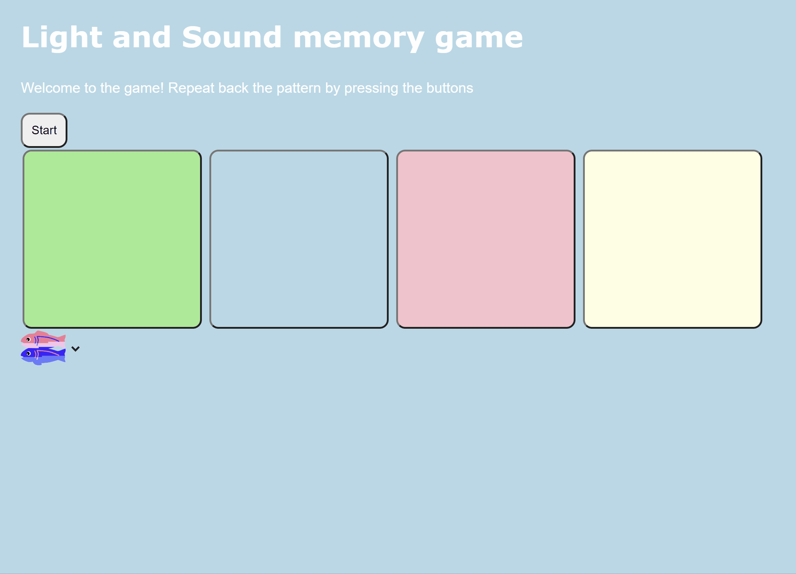
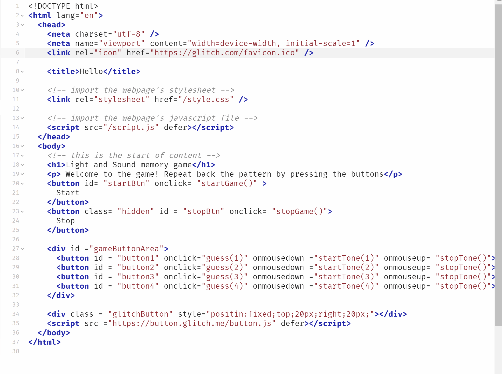

# codepath-prework-internship
# Pre-work - *Memory Game*

**Memory Game** is a Light & Sound Memory game to apply for CodePath's SITE Program. 

Submitted by: **Jaskiran Parmar**

Time spent: **2** hours spent in total

Link to project: (insert your link here, should start with https://glitch.com...)

## Required Functionality

The following **required** functionality is complete:

* [ ] Game interface has a heading (h1 tag), a line of body text (p tag), and four buttons that match the demo app
* [ ] "Start" button toggles between "Start" and "Stop" when clicked. 
* [ ] Game buttons each light up and play a sound when clicked. 
* [ ] Computer plays back sequence of clues including sound and visual cue for each button
* [ ] Play progresses to the next turn (the user gets the next step in the pattern) after a correct guess. 
* [ ] User wins the game after guessing a complete pattern
* [ ] User loses the game after an incorrect guess

- [ ] List anything else that you can get done to improve the app!

## Video Walkthrough (GIF)

If you recorded multiple GIFs for all the implemented features, you can add them here:

## Reflection Questions
1. If you used any outside resources to help complete your submission (websites, books, people, etc) list them here. 
While going forth and attempting my submission for the CodePath 2022 Summer Internship at site, some outside sources that I have used in order to help me complete my submission would be W3Resource.com and the FreeCodeCamp youtube video "Learn HTML CSS From Scratch". From both of these resources, I was able to gain a clear understanding of how to use certain controls such as the active button, hexidecimal, and fundamental knowledge of JavaScript to be able to understand my code. Along with this, the  website W3Resource.com allowed me to understand what a div element is.

2. What was a challenge you encountered in creating this submission (be specific)? How did you overcome it? (recommended 200 - 400 words) 
One challenge I have encountered in creating this submission would be creating the buttons and having the background light up and coordinate to my css code. While trying to make my 4 buttons light up and coordinate with the sound, I have found it difficult to have the buttons start playing after the "start button" was pushed, and play the correct sound that was designed. Along with this, implementing the sound feature within the website was a challenged I encountered as well, as certain times, the correct sound would not play or be delayed. One way I overcame this challenge was through a series of steps and procedures. I first began in debugging the code, and see where in my CSS and JS file was wrong. I began looking at the coded parts of the #active buttons, and the color code as well, as certain functions in the javascript file. The 2nd step I have done after this was check that I have inserted all the correct code that was given from the codepath prework to ensure that I have copied and pasted the  correct functions with my own additional details. Finally, with these two steps involved I have figured out the steps needed to be done to fix my code, in which I have forgotten to add the turn on function for the button.

3. What questions about web development do you have after completing your submission? (recommended 100 - 300 words) 
After completing my submission for the Codepath Summer 2022 Internship I am really curious about how website are created and want to learn more on how html, css and js are incorpated into a website. Using a IDE like Glitch has really opened my perspective on web development and I question on how certain website are created with security, how do website transfer message, and how can one webpage, link into another webage, like youtube, and faceebook? I question as well, if there are databases and servers that hold certain websites, and how do we use those when creating on.

4. If you had a few more hours to work on this project, what would you spend them doing (for example: refactoring certain functions, adding additional features, etc). Be specific. (recommended 100 - 300 words) 
If I had a few more hours to work on this project, i would like to work on a couple of more features such as incorpating "lives" on my memory game and displaying it, and including a feature where maybe the sound could be used from recent music. Along with this, I would love to be able to refactor certain functions to make them work effiecently and faster, and incorporate more buttons that a user can use such as a "hint" button. Futher along this, with more time, I would have like to also be able to expand the website where, there can be extension of this game, taking you to another "level" in the form of a "linked webpage"

## Interview Recording URL Link

[My 5-minute Interview Recording](https://www.youtube.com/watch?v=pw3c5VI_O38)

## License

    Copyright [Jaskiran Parmar]

    Licensed under the Apache License, Version 2.0 (the "License");
    you may not use this file except in compliance with the License.
    You may obtain a copy of the License at

        http://www.apache.org/licenses/LICENSE-2.0

    Unless required by applicable law or agreed to in writing, software
    distributed under the License is distributed on an "AS IS" BASIS,
    WITHOUT WARRANTIES OR CONDITIONS OF ANY KIND, either express or implied.
    See the License for the specific language governing permissions and
    limitations under the License.
